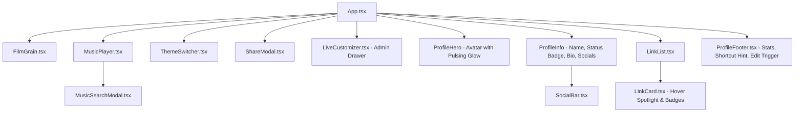

# Design & Architecture Specification: Cyberpunk & Dark Glassmorphism Linktree Hub

## 1. Overview & Vision

**Linktree Hub** is an ultra-modern, high-performance personal bio link application featuring a futuristic aesthetic (*Dark Glassmorphism, subtle neon glow, mesh radial gradients, film grain texture, and tactile micro-interactions*). It is directly inspired by the personal design language of kyiov (`MUH4RHQ / portofolio-`).

The application serves dual purposes:
1. **Public Showcase Hub**: An immersive, aesthetic portfolio and link directory with integrated ambient lo-fi audio playback, dynamic QR sharing, and theme personalization.
2. **In-Browser Live Customizer / Admin Mode**: A lightweight, zero-backend configuration drawer allowing the owner to live-edit links, profile bio, avatar, and themes with immediate preview and one-click `config.json` export.

Built with a pure client-side stack: **React 19 + Vite 6 + TypeScript 5.7 + Tailwind CSS 3.4 + Lucide Icons + Web Audio API**.

---

## 2. Design System & Aesthetics

### 2.1 Color Palettes & Theme Presets
The app operates on dynamic CSS variables (`--color-bg`, `--color-surface`, `--color-accent`, `--color-text`, `--color-border`) switched seamlessly without full-page reloads:

| Theme Preset | Identifier | Primary Accent | Background Surface | Mood / Aesthetic |
| :--- | :--- | :--- | :--- | :--- |
| **Muhar Burgundy** *(Signature)* | `signature` | `#6f4c56` (Rosewood) | `#2b0e18` (Deep Wine) | Warm editorial, nostalgic vinyl |
| **Cyber Cyan** | `cyber` | `#00f2fe` (Electric Cyan) | `#050505` (Abyss Dark) | High-contrast neon cyberpunk |
| **Matrix Emerald** | `emerald` | `#10b981` (Mint Neon) | `#03140e` (Cyber Jungle) | Terminal hacker matrix glow |
| **Monochrome Noir** | `noir` | `#ffffff` (Pure White) | `#09090b` (Deep Zinc) | Ultra-minimalist luxury dark |

### 2.2 Material & Surface Language
- **Glassmorphic Cards**: `bg-zinc-900/60 backdrop-blur-xl border border-white/10 hover:border-[var(--color-accent)]/50`
- **Subtle Film Grain**: Hardware-accelerated SVG noise overlay (`pointer-events-none opacity-25 fixed inset-0`) giving an organic retro-film feel.
- **Radial Mesh Glow Blobs**: Subtle ambient background gradients placed off-center to create spatial depth.
- **Typography**:
  - **Heading & Tech Accent**: `Space Grotesk` / `DM Sans` / `Plus Jakarta Sans`
  - **Hero Signature Title**: `Fraunces` & `Salsa BT`
  - **Body & Captions**: `DM Sans` with clean tabular numbers for stats and durations.

---

## 3. Core Component Hierarchy & Data Flow

### Data Pipeline
1. **Deterministic Boot**: Config is loaded synchronously from `src/config/config.json`.
2. **Local Overrides**: Theme preference (`linktree_theme`) and user-selected audio track (`linktree_current_track`) persist in `localStorage` and `IndexedDB`.
3. **Admin Mode State**: Live Customizer binds to an in-memory copy of `AppConfig`, offering real-time re-rendering of all components, downloadable `config.json` payload generation, and quick JSON clipboard copying.

---

## 4. Functional Specifications

### FS-001: Profile Header & Operational Status
- **Avatar Presentation**: High-resolution circular avatar with dynamic pulsating neon glow ring. Smooth fallback to local asset `/avatar.jpg` if network fails.
- **Operational Badge**: Pulsing green dot badge (`🟢 Available for projects`) indicating immediate freelance/collaboration availability.
- **Creator Identity**: Display name (`Muhar`), handle (`@muhar_fg`), and title (`Developer & Creator`).
- **Tactile Social Bar**: Direct links for Instagram, GitHub, and Telegram with magnetic hover glow and Web Audio click haptics.

### FS-002: Dynamic Categorized Link Cards
- **Visual Composition**: Glassmorphic container with left-hand Lucide icon, prominent title, explanatory description subtitle, and right-hand arrow trigger.
- **Badges**: Optional pill tags (`Personal`, `App`, `API`, `🔥 Featured`, `⚡ New`).
- **Micro-Interactions**:
  - Cursor spotlight: radial gradient tracking mouse position on desktop.
  - Scale transition: smooth `scale-[1.015]` on hover and `scale-[0.985]` on click.
- **Security**: Strict `target="_blank" rel="noopener noreferrer"` attributes.

### FS-003: Ambient Audio & Tactile Sound FX
- **Music Player Bar**: Discreet floating pill positioned at top header with soundwave audio visualizer, play/pause toggle, and search trigger.
- **Default Track**: *Snowfall* (Øneheart & reidenshi) with zero-buffering local audio asset (`/audio/snowfall.mp3`).
- **Music Search Modal**:
  - Direct URL stream and local audio file upload via client-side IndexedDB caching.
  - Curated evaluation themes: *Snowfall*, *Daisy* (STEREO DIVE FOUNDATION), and *Twilight Sunset Drive*.
- **Synthesized Haptics**: Web Audio API oscillator producing subtle click taps on link interactions and pleasant ascending chimes on successful copy events.

### FS-004: Interactive Theme Switcher
- Floating or header-anchored dropdown selector showing live color swatches.
- Immediate updates to CSS variables and `data-theme` attribute on `document.documentElement`.
- Remembers user selection across reloads via `localStorage`.

### FS-005: Quick Share & Dynamic QR Code Modal
- Floating or header share button triggering glassmorphic modal.
- Generates a vector QR Code of the current profile URL using `qrcode`.
- Single-click "Copy Link" button with audio chime and "Copied! ✨" toast confirmation.
- Triggers native `navigator.share()` on supported mobile devices.

### FS-006: In-Browser Live Customizer (Admin Mode)
- **Dual Trigger**: Accessible via footer edit button, URL parameter `?mode=edit` / `?edit=true`, or pressing `E`.
- **Form Fields**: Edit Display Name, Bio, Avatar URL, Status text, Social Links, and Link Items (Add, Delete, Edit title/URL/badge/description, Reorder).
- **Live Preview**: Edits immediately reflect on the rendered page.
- **Export & Sync**:
  - `Export config.json`: Triggers direct download of the updated JSON file ready to replace `src/config/config.json`.
  - `Copy JSON`: Copies full JSON to clipboard.
  - `Reset`: Reverts back to initial default config.

### FS-007: Keyboard Accessibility & Shortcuts
- `1` – `9`: Instantly launch link item by index.
- `M`: Toggle background audio playback.
- `S` or `/`: Open Music Search Modal.
- `C`: Copy profile URL to clipboard.
- `E`: Toggle Live Customizer drawer.

---

## 5. Technical Requirements & Non-Goals

### Non-Goals
- No external relational database or OAuth server required (zero maintenance cost).
- No server-side runtime dependency — builds to 100% static assets for Netlify, Vercel, or GitHub Pages.

### Performance & Bundle Targets
- **Time-to-Interactive (TTI)**: < 0.5s on mobile broadband.
- **Lighthouse Scores**: 95+ on Performance, Accessibility, and Best Practices.
- **Responsive Viewport Range**: Fully optimized from 320px (iPhone SE) to 4K displays.
